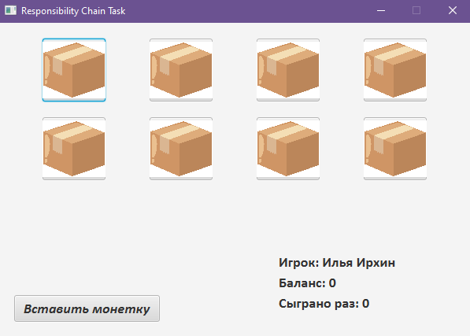
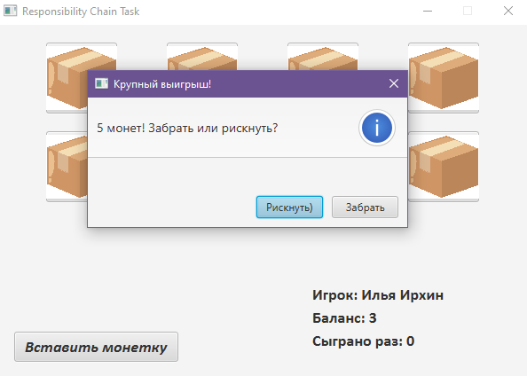
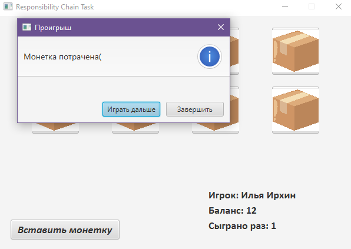
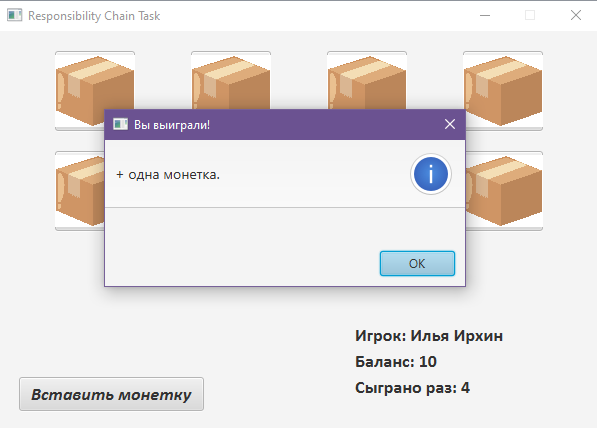
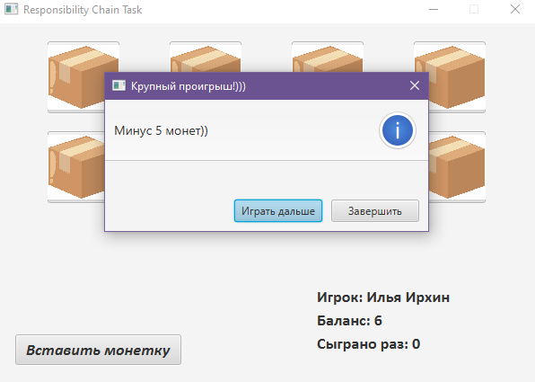
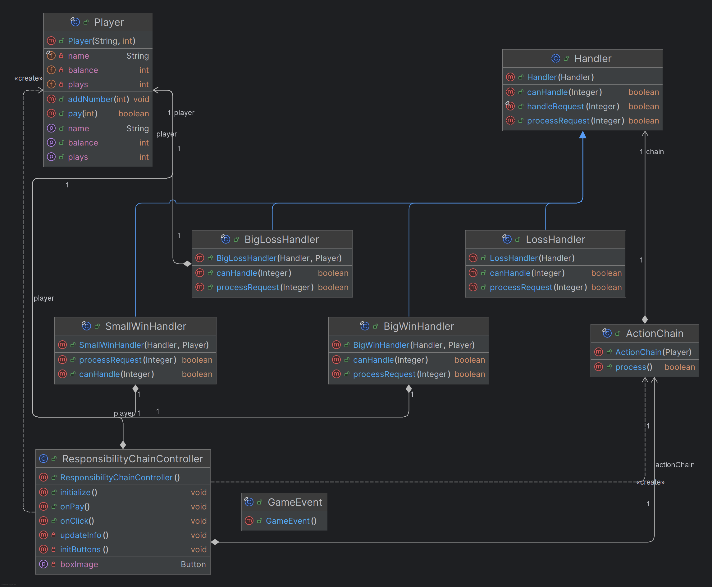

# Игровой автомат (Chain of Responsibility)

Таск на **Java + JavaFX**, демонстрирующий применение шаблона проектирования **Цепочка обязанностей (Chain of Responsibility)**.  

---

## Скриншот окна



Скриншот окна приложения 1



Скриншот окна приложения 2



Скриншот окна приложения 3



Скриншот окна приложения 4


Скриншот окна приложения 5



Скриншот окна приложения 6

---

## Диаграмма классов приложения



Диаграмма классов приложения

---

## Суть таска

Игрок взаимодействует с игровым автоматом:
- вносит монеты;
- выбирает одну из коробок (кнопки с изображениями);
- получает случайный результат: выигрыш или проигрыш;
- принимает решение — продолжить игру или завершить её.

Выбор коробки **не влияет** на результат — это намеренно сделано для демонстрации паттерна.

---

## Используемый паттерн

### Chain of Responsibility

> Запрос передаётся по цепочке обработчиков, каждый из которых решает,
> может ли он обработать данный запрос, либо передаёт его дальше.

В проекте:
- **Запрос** — тип игрового события (`LOSS`, `SMALL_WIN`, `BIG_WIN`, `BIG_LOSS`);
- **Handler** — абстрактный обработчик;
- **ConcreteHandler** — конкретные сценарии выигрыша и проигрыша;
- **Client** — JavaFX-контроллер.

---

## Архитектура

```text
Controller
   |
   v
ActionChain
   |
   v
BigWinHandler -> SmallWinHandler -> BigLossHandler -> LossHandler
```

- Контроллер не знает, какой обработчик будет вызван;
- Логика игры полностью инкапсулирована в обработчиках;
- Цепочка может быть легко изменена или расширена.

---

## Автор

Ирхин Илья
